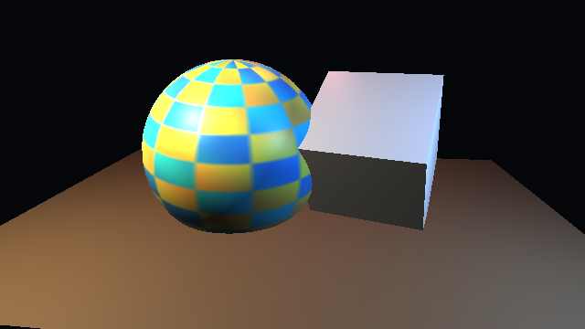

# py_gpu

`py_gpu` is a small rendering-core package for Python scene libraries that need
to grow from simple CPU rendering toward modern GPU-style throughput.

The immediate companion project is `py_3d`, but this repository should stay
cleanly reusable: it owns backend detection, batching contracts, frame buffers,
and accelerated renderer experiments. Scene construction, physics, and high
level demos can live elsewhere.

## Why This Exists

Game engines render huge scenes quickly because they avoid per-object Python
work in the hot path. They batch geometry, keep backend contracts stable, upload
large buffers once, reuse device resources, and let the GPU do deeply parallel
work. `py_gpu` is the place to build those ideas without making `py_3d` messy.

The target shape is:

```text
Python scene package -> adapter -> render batch -> backend -> frame/output
```

Current status:

- Dependency-free `FrameBuffer` and `DepthBuffer`.
- Screen-space `RasterBatch`, `ScreenTriangle`, and `ScreenVertex` contracts.
- A small CPU raster backend for correctness and fallback use.
- A real offscreen ModernGL backend for projected triangle batches when OpenGL
  is available.
- An optional NumPy raster backend selected by `select_backend("auto")` when
  ModernGL is unavailable and NumPy is installed.
- Optional backend detection for WebGPU, OpenGL, Vulkan, CuPy, Numba, and
  PyTorch packages.
- Optional `py_3d` adapter that can return a `py_3d.PixelBuffer` with reference
  visual parity, while still exposing an experimental flat batch backend path.

This is not yet a full GPU renderer. The first goal is a clean, measurable
contract that real GPU backends can implement without changing user scenes.

## Preview


<video src="renderings-tests/py_gpu_preview.mp4" controls width="640"></video>

[View the py_gpu preview MP4](renderings-tests/py_gpu_preview.mp4)

## Lit 3D Shape Preview



<video src="renderings-tests/gpu_lit_textured_shapes.mp4" controls width="640"></video>

[View the GPU lit textured shapes MP4](renderings-tests/gpu_lit_textured_shapes.mp4)

## Install

Editable development install:

```bash
python -m pip install -e ".[dev]"
python -m pytest
```

Optional backend experiments:

```bash
python -m pip install -e ".[opengl]"
python -m pip install -e ".[webgpu]"
python -m pip install -e ".[numeric]"
```

## Basic Use

Render projected triangles into a dependency-free frame buffer:

```python
from py_gpu import RasterBatch, ScreenTriangle, ScreenVertex, select_backend

batch = RasterBatch([
    ScreenTriangle(
        ScreenVertex(80, 20, 1.0),
        ScreenVertex(20, 120, 1.0),
        ScreenVertex(140, 120, 1.0),
        (220, 80, 40),
    )
])

backend = select_backend("cpu")
frame = backend.render(batch, width=160, height=140, background=(8, 10, 14))
frame.to_png("triangle.png")
```

Use the fastest available backend:

```python
backend = select_backend("auto")
```

Force the offscreen OpenGL backend:

```python
backend = select_backend("moderngl")
```

Use the first `py_3d` bridge:

```python
from py_3d import RenderEngine
from py_gpu.adapters.py3d import Py3DRasterRenderer

engine = RenderEngine(Py3DRasterRenderer())
buffer = engine.render(scene, camera, settings)
buffer.to_png("py3d-via-pygpu.png")
```

The adapter defaults to reference-compatible rendering so live `py_3d` windows
match the fully shaded CPU outputs. Use `Py3DRasterRenderer(reference_compatible=False)`
to exercise the current flat batch backend. Lighting, textures, smooth vertex
attributes, and persistent GPU uploads should be added behind this same shape
before the accelerated path becomes the default for full scenes.

## Benchmarks

Run the current screen-space raster benchmark:

```bash
python examples/benchmark_raster.py --backend auto --frames 60 --triangles 1000 --width 640 --height 360
python examples/benchmark_raster.py --backend moderngl --frames 60 --triangles 1000 --width 640 --height 360
python examples/benchmark_raster.py --backend cpu --frames 10 --triangles 1000 --width 640 --height 360
```

Write a visual benchmark frame:

```bash
python examples/benchmark_raster.py --triangles 1000 --output raster-benchmark.png
```

On one Windows development machine with an RTX 4090, the current 1000 triangle
`640x360` benchmark measured about `131.6 fps` through the ModernGL backend,
about `8.8 fps` through the NumPy backend, and about `0.8 fps` through the plain
Python CPU backend. Treat local benchmark numbers as machine-specific, not a
promise.

Generate README preview media:

```bash
python examples/render_preview.py --backend auto
python examples/render_lit_textured_shapes.py
```

## Architecture

`py_gpu` should grow in layers:

- `buffers`: frame and depth buffers that can be written to images or copied
  into external packages.
- `geometry`: compact projected batch contracts.
- `backends`: protocol, capabilities, and selection logic.
- `raster`: reference CPU rasterizer for correctness.
- `numpy_raster`: optional vectorized CPU rasterizer.
- `moderngl_backend`: optional offscreen OpenGL rasterizer.
- `adapters`: optional bridges from scene packages such as `py_3d`.

Backends should expose capabilities rather than pretending every implementation
supports every feature. A backend can start with flat color triangles, then add
textures, vertex attributes, instancing, depth formats, or compute passes.

## Direction

Near-term work:

- Add a world-space mesh batch format with positions, normals, UVs, material
  ids, and indices.
- Add a `py_3d` adapter path that preserves lights, textures, and smooth vertex
  normals.
- Add persistent batch handles so static geometry does not need to be rebuilt
  every frame.
- Prototype a WebGPU backend through `wgpu` or an OpenGL backend through
  `moderngl`.
- Keep the CPU raster backend as the correctness reference for small scenes.
- Add benchmark fixtures for thousands, tens of thousands, and hundreds of
  thousands of triangles.

Long-term work:

- Instancing and shared mesh buffers.
- Texture atlases and sampler modes.
- Depth, normal, object-id, and color attachments.
- Async frame readback for screenshots and offline video.
- Compute-friendly buffers for simulations that later feed rendering.

## Design Rules

- Keep scene APIs out of this core package. Scene packages should adapt into
  `py_gpu` batches.
- Keep backend dependencies optional.
- Do not make a GPU backend mandatory for correctness tests.
- Prefer explicit capabilities and clear failure modes.
- Measure every performance claim with a reproducible benchmark.
- Keep Python per-frame work small; batching and resource reuse matter more
  than clever per-pixel Python.
